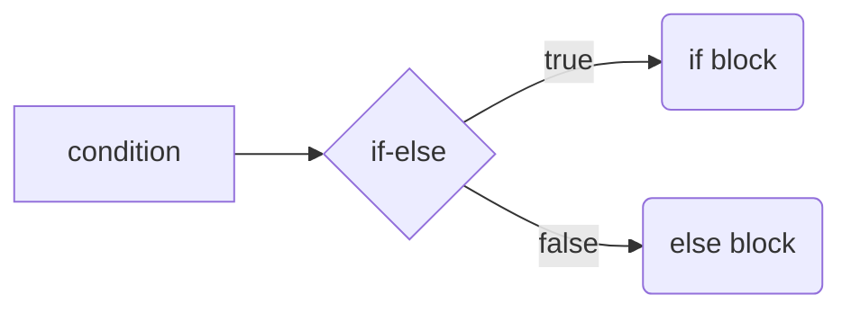

# Chapter5-Condition

## Introduction

在上一個章節中，我們花費了很大的篇幅介紹邏輯運算子。這在這個章節中，我們會進一步講解如何使用條件語句(if-else statement)。

if-else statement 的語法如下所示：

```javascript
if ( /* 條件 */ ) {
    // 若條件為 true，則執行這個區塊的程式碼
} else {
    // 若條件為 false，則執行這個區塊的程式碼
}
```

其 diagram 如下所示：



#### 範例

```javascript
let num = 1;

if (num % 2 == 0) {
    // 若 num % 2 == 0，則執行這裡的程式碼
    console.log("is even number");  
} else {
    // 否則，執行這裡的程式碼
    console.log("is odd number");
}
```

#### 執行結果

```javascript
is odd number
```

## Nested if-else statement

當我們有多個條件需要判斷時，我們可以將一個 `if-else` 包裹在另一個 `if-else` 之中，如下所示：

```javascript
let studentGrade = 87;

if (studentGrade >= 90) {
    // 若學生成績大於等於 90 分
    console.log("GPA: A");
} else {
    // 否則
    if (90 > studentGrade && studentGrade >= 80) {
        // 若學生成績小於 90 分且學生成績大於等於 80 分
        console.log("GPA: B");
    } else {
        // 否則
        if (80 > studentGrade && studentGrade >= 70) {
            // 若學生成績小於 80 分且學生成績大於等於 70 分
            console.log("GPA: C");
        } else {
            // 否則
            if (70 > studentGrade && student >= 60) {
                // 若學生成績小於 70 分且學生成績大於等於 60 分
                console.log("GPA: D");
            } else {
                // 否則
                console.log("GPA: F");
            }
        }
    }
}
```

#### 執行結果

```bash
GPA: B
```

我們會發現，當我們將多層 `if-else` 包裹起來時，程式碼會逐漸向內縮，且留下非常多大括號。這會導致程式碼變得很「巢(nested)」。這種代碼的可讀性極差，因此我們衍生出了下面這種 `else-if`  寫法：

```javascript
let studentGrade = 87;

if (studentGrade >= 90) {
    // 若學生成績大於等於 90 分
    console.log("GPA: A");
} else if (90 > studentGrade && studentGrade >= 80) {
    // 否則若學生成績小於 90 分且學生成績大於等於 80 分
    console.log("GPA: B");
} else if (80 > studentGrade && studentGrade >= 70) {
    // 否則若學生成績小於 80 分且學生成績大於等於 70 分
    console.log("GPA: C");
} else if (70 > studentGrade && student >= 60) {
    // 否則若學生成績小於 70 分且學生成績大於等於 60 分
    console.log("GPA: D");
} else {
    // 否則
    console.log("GPA: F");
}        
```

>   這種寫法實際上並不是一種獨立於 `if-else` 的語法，而是一種由 `if-else` 衍生出的特化寫法，其做法是將 `else` 後面接續的成對大括號去除，並將 `if` 從 `else` 下方移動到 `else` 後方。

## 三元運算子

三元運算子（ternary operator），是一種 `if-else` 語句的簡化寫法，可以將結構簡單的 `if-else` 進行進一步化簡，其形式如下

```javascript
/* 條件 */ ? /* 條件為 true 時執行這裡 */ : /* 條件為 false 時執行這裡 */
```

#### 範例

```javascript
let num = 2;
let isEven = num % 2 == 0 ? true : false;
console.log(isEven);


// 上面的程式碼等價於：
// let num = 2;
// let isEven;
// if (num % 2 == 0) {
//     isEven = true;
// } else {
//     isEven = false;
// }
```

#### 執行結果

```bash
true
```

可以發現，當條件及行為都很簡單時，三元運算子可以顯著的簡化程式碼結構。但在使用時要注意一點，當邏輯或行為較複雜時，使用三元運算反而會導致程式碼變得極度混亂。

## Switch

當我們需要根據單一變數的不同值做出多種選擇時，可以使用 `switch` 語句替代多層的 `if-else`：

#### 範例：

```javascript
let day = 3;
let dayName;

switch(day) {
    case 1:
        dayName = "Monday";
        break;
    case 2:
        dayName = "Tuesday";
        break;
    case 3:
        dayName = "Wednesday";
        break;
    case 4:
        dayName = "Thursday";
        break;
    case 5:
        dayName = "Friday";
        break;
    case 6:
        dayName = "Saturday";
        break;
    case 7:
        dayName = "Sunday";
        break;
    default:
        dayName = "Invalid dayName";
}

console.log(dayName)  // Wednesday
```

#### 注意事項

-   每個 `case` 後需要加上 `break`，否則會繼續執行下一個 case。
-   `default` 選項負責處理沒有被歸類在 `case` 中的選項，因此會被放在最後一個。由於後面沒有其他 `case`，因此不需要加上 `break`。
-   `case` 在進行條件判斷時，使用**嚴格相等（===）**。

