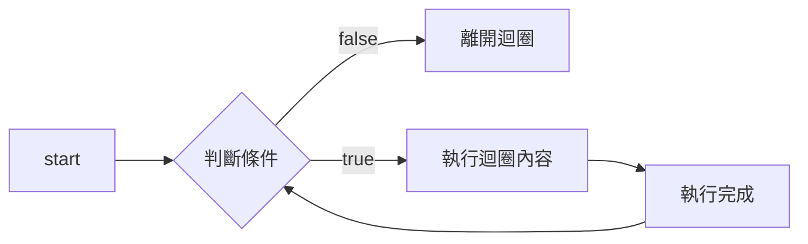
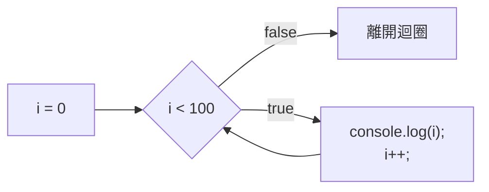

# Chapter6-Loop

## Introduction

當我們在執行程式時，很常重複進行類似的動作，此時我們可以利用「迴圈（Loop）」來協助完成。

## while

while 迴圈的結構如下所示：

```javascript
while (/* 條件 */) {  // Step1. 判斷條件
    // Step2. 當條件為 true 時，執行內容
    // Step3. 執行完成時，返回 Step 1
}  // Step4. 當條件為 false 時，離開迴圈
```

其 diagram 如下所示：



範例：
```javascript
let i = 0;
while (i < 100) {
    console.log(i);
    i++;
}
```

執行結果：
```javascript
0
1
2
......
98
99
```

上述程式碼跑起來的 diagram 如下：


## for
在上面的while迴圈中，我們實際上依序做了以下幾件事情：
1. 設定初始值：
    ``` javascript
    let i = 0;
    ```

2. 設定迴圈循環條件：
    ```javascript
    while(i < 100) {
        // ......
    }
    ```

3. 執行迴圈內代碼：
    ```javascript
    console.log(i);
    ```
4. 初始值遞增：
    ```javascript
    i++;
    ```
在上述四步中，實際上我們真正要做的事情只有步驟三，其他三步都只是為了告訴 `while` 迴圈我們要「執行100次」。更直白的說，我們的變數 `i` 在脫離 `while` 迴圈後其實就沒有任何用處了，他只是作為一個迴圈的「計數器」而存在。

但在這段程式碼中，我們卻需要將他宣告在迴圈外部。這種將計數器宣告在迴圈外的寫法實際上這是一種不太好的實作方式。為了解決這個問題，我們可以使用 `for` 迴圈，其語法如下：

```javascript
for(/* 初始條件 */ ; /* 循環條件 */ ; /* 更新表達式 */) {
    // 執行內容
}
```
#### 範例
```javascript
for (let i = 0 ; i < 100 ; i++) {
    console.log(i);
}

// 上面的寫法基本等價於以下的寫法：
// let i = 0;
// while(i < 100) {
//    console.log(i);
//    i++;
// }
```
當我們在迴圈結束後不再使用到計數器時，使用 `for` 會比 `while` 好的多，原因有以下幾點：

1. 計數器 `i` 的生命週期：當我們將 `i` 宣告在 `for` 迴圈的括號內時，他會在程式離開迴圈後被銷毀，因此在迴圈外部是讀不到他的。這可以避免我們在其他地方不小心更改到 `i` 的值。

2. 可讀性：將迴圈的初始值設定、循環條件、遞增方式寫在同一行，可以在語意上更好的表達他們三者都是為了同一個迴圈服務的。