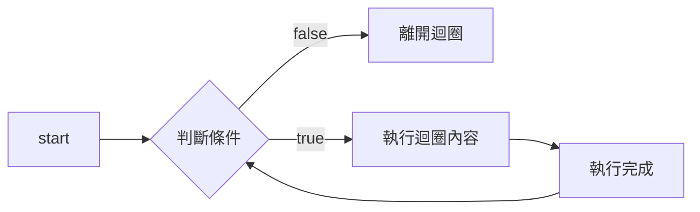

# Chapter6-Loop

## Introduction

當我們在執行程式時，很常重複進行類似的動作，此時我們可以利用「迴圈（Loop）」來協助完成。

## while

while 迴圈的結構如下所示：

```javascript
while (/* 條件 */) {  // Step1. 判斷條件
    // Step2. 當條件為 true 時，執行內容
    // Step3. 執行完成時，返回 Step 1
}  // Step4. 當條件為 false 時，離開迴圈
```

其 diagram 如下所示：



範例：
```javascript
let i = 0;
while (i < 100) {
    console.log(i);
    i++;
}
```

執行結果：
```javascript
1
2
3
......
98
99
```